# 🌡️ Smart AC Control System

An **intelligent IoT-based air conditioning control system** that combines AI-powered temperature optimization, computer vision occupancy detection, and multi-platform control interfaces to deliver automated, energy-efficient climate management.


---

## 📌 Project Overview

The **Smart AC Control System** is a comprehensive IoT solution that revolutionizes air conditioning management through:

* **🤖 AI-Powered Intelligence** - Machine learning models for temperature optimization and occupancy detection
* **📱 Multi-Platform Control** - Mobile app, LabVIEW interface, and cloud-based management
* **🌐 IoT Integration** - ESP32-based hardware with Firebase cloud synchronization
* **⚡ Energy Efficiency** - Intelligent automation to reduce power consumption while maintaining comfort
* **🔄 Real-time Operation** - Continuous monitoring and adaptive control based on environmental conditions
* **📍 Location Awareness** - Geofencing and occupancy-based automation features

This system seamlessly integrates hardware, software, and AI technologies to create a smart home solution that learns user preferences and optimizes energy usage automatically.

---

## 🔍 System Architecture

```mermaid
graph TB
    subgraph "Hardware Layer"
        ESP32[ESP32 Firmware<br/>• IR Control<br/>• WiFi Connectivity<br/>• Real-time Monitoring]
        CAM[ESP32-CAM<br/>• Image Capture<br/>• Occupancy Detection]
    end
    
    subgraph "AI Processing Layer"
        OCC[Occupancy AI<br/>• MobileNetV2<br/>• Computer Vision<br/>• Binary Classification]
        TEMP[Temperature AI<br/>• ML Prediction<br/>• Weather Integration<br/>• Optimization]
    end
    
    subgraph "Cloud Infrastructure"
        FB[(Firebase RTDB<br/>• Real-time Sync<br/>• Authentication<br/>• Data Storage)]
        API[Weather APIs<br/>• Environmental Data<br/>• Outdoor Conditions]
    end
    
    subgraph "User Interfaces"
        MOBILE[📱 Airvix Mobile App<br/>• Remote Control<br/>• Geofencing<br/>• Scheduling]
        LAB[🎛️ LabVIEW Interface<br/>• Professional Control<br/>• Data Visualization<br/>• System Monitoring]
    end
    
    CAM --> OCC
    OCC --> FB
    API --> TEMP
    FB --> TEMP
    TEMP --> FB
    FB --> ESP32
    ESP32 --> FB
    FB --> MOBILE
    FB --> LAB
    
    style ESP32 fill:#e1f5fe
    style CAM fill:#e1f5fe
    style OCC fill:#f3e5f5
    style TEMP fill:#f3e5f5
    style FB fill:#fff3e0
    style API fill:#e8f5e8
    style MOBILE fill:#fce4ec
    style LAB fill:#f1f8e9
```



---

## 🔧 System Components

### 🌐 **ESP32 Firmware** 
**Location**: [`esp32_firmware/`](./esp32_firmware/)

Intelligent IoT firmware for ESP32 microcontrollers providing:
- **Multi-Mode Operation**: Basic, Scheduled, Occupancy, and Smart AI control modes
- **IR Communication**: Wireless infrared command transmission to AC units
- **Firebase Integration**: Real-time cloud database connectivity
- **Visual Feedback**: LED indicators for system status
- **Smart Delays**: Optimized command intervals to prevent system overload

**Technologies**: ESP32, C++, Firebase SDK, IRremote Library, Arduino IDE

---

### 🤖 **AI Models** 
**Location**: [`ai_models/`](./ai_models/)

Sophisticated machine learning systems for intelligent automation:

#### 🕵️‍♂️ **Human Occupancy Detection** ([`ai_models/human_detection/`](./ai_models/human_detection/))
- **Purpose**: Real-time presence detection using computer vision
- **Technology**: MobileNetV2-based deep learning with TensorFlow
- **Performance**: 95%+ accuracy with <2 second response time
- **Integration**: ESP32-CAM image capture with Firebase status updates

**Full Repository**: [AI-Powered Human Occupancy Detection System](https://github.com/SahanUday/AI-powered-human-occupancy-detection-system)

#### 🌬️ **Temperature Prediction** ([`ai_models/ac_temperature/`](./ai_models/ac_temperature/))
- **Purpose**: Intelligent temperature optimization using environmental data
- **Technology**: Machine learning with weather API integration
- **Features**: Multi-factor analysis, real-time predictions, user personalization
- **Operation**: Continuous updates every 20 seconds

**Full Repository**: [AI-Powered AC Temperature Prediction System](https://github.com/SahanUday/AI-Powered-AC-Temperature-Prediction-System)

---

### 📱 **Mobile Application - Airvix** 
**Location**: [`mobile_app/`](./mobile_app/)

Comprehensive Android application built with Flutter featuring:
- **Complete AC Control**: Power, temperature, mode selection (Cool/Heat/Fan/Dry)
- **Smart Geofencing**: Location-based automatic AC control
- **AI Integration**: Intelligent temperature recommendations
- **Advanced Scheduling**: Flexible timer-based automation
- **Real-time Dashboard**: Live sensor data and system status monitoring
- **User Feedback System**: Comfort level input for AI optimization

**Full Repository**: [Airvix - Smart AC Remote Control App](https://github.com/SahanUday/Airvix-App)

**Technologies**: Flutter, Firebase, Material Design, Location Services, Cloud Integration

---

### 🎛️ **LabVIEW Control Interface** 
**Location**: [`labview_control/`](./labview_control/)

Professional desktop application for advanced system management:
- **Real-time Monitoring**: Live AC system status and environmental conditions
- **Data Visualization**: Interactive charts, graphs, and trend analysis
- **Multi-Mode Control**: Switch between all control modes with advanced configuration
- **System Diagnostics**: Built-in troubleshooting and maintenance tools
- **Data Export**: Historical data export to CSV, Excel, and custom formats
- **Alert System**: Visual and audio notifications for system events

**Technologies**: LabVIEW 2020+, Firebase REST API, Real-Time Module, Database Connectivity

---

## 🚀 Getting Started

### ✅ **Prerequisites**

**Hardware Requirements:**
- ESP32 development board (ESP32-DevKitC recommended)
- ESP32-CAM module for occupancy detection
- IR LED transmitter and status indicator LED
- Stable Wi-Fi network connection

**Software Requirements:**
- [Arduino IDE](https://www.arduino.cc/en/software) (1.8.19+)
- [Flutter SDK](https://flutter.dev/docs/get-started/install) (3.0+)
- [LabVIEW 2020+](https://www.ni.com/en-us/shop/labview.html)
- Firebase project with Realtime Database enabled
- OpenWeather API key for weather integration

### 🔐 **Setup Instructions**

**1. Clone the Repository:**
```bash
git clone https://github.com/SahanUday/Smart-AC-Control-System.git
cd Smart-AC-Control-System
```

**2. Configure Firebase:**
- Create a new Firebase project at [Firebase Console](https://console.firebase.google.com/)
- Enable Realtime Database and Authentication
- Download configuration files for each platform

**3. ESP32 Firmware Setup:**
```bash
cd esp32_firmware
cp config.h.template config.h
# Edit config.h with your WiFi and Firebase credentials
```

**4. Mobile App Setup:**
```bash
cd mobile_app
flutter pub get
# Configure Firebase for Flutter following the official guide
flutter run
```

**5. AI Models Setup:**
```bash
cd ai_models
pip install -r requirements.txt
# Configure Firebase credentials and OpenWeather API key
python occupancy_detection.py
python temperature_prediction.py
```

---

## 🎮 Control Modes

### 🔹 **Basic Mode**
Direct manual control via any interface with immediate command execution.

### 🔹 **Scheduled Mode**
Time-based automation with configurable delay periods for energy efficiency.

### 🔹 **Occupancy Mode**
Automatic AC control based on room presence detection using computer vision.

### 🔹 **Smart Mode**
AI-powered temperature optimization using environmental data and weather conditions.

### 🔹 **Hybrid Modes**
Combined Smart + Occupancy mode for maximum efficiency and comfort optimization.

---

## 📊 Performance Metrics

* **🎯 Occupancy Detection Accuracy**: 95%+ with low false positive rates
* **⚡ Response Time**: <2 seconds for occupancy detection and AI predictions
* **🔋 Energy Savings**: Up to 30% reduction in AC power consumption
* **🌐 System Uptime**: 99.5% reliability with cloud-based backup
* **📱 Mobile App Rating**: Smooth performance on Android 8.0+ devices
* **🎛️ LabVIEW Interface**: Real-time data updates with <1 second latency

---

## 🔄 Integration Flow

1. **ESP32-CAM** captures room images and sends to occupancy detection AI
2. **Occupancy AI** processes images and updates presence status in Firebase
3. **Temperature AI** analyzes environmental data and weather conditions
4. **Firebase Database** synchronizes all data across system components
5. **Control Interfaces** (Mobile/LabVIEW) provide user interaction and monitoring
6. **ESP32 Firmware** executes AC commands based on AI recommendations and user input

---

## 🤝 Contributing

We welcome contributions to enhance the Smart AC Control System! Here are ways you can help:

### 🌟 **Enhancement Areas:**
- 📈 **AI Improvements**: Enhanced model accuracy and new ML algorithms
- 🏢 **Multi-Room Support**: Expand to building-wide deployment
- 📊 **Analytics Dashboard**: Advanced energy monitoring and reporting
- 🔐 **Security Features**: Enhanced authentication and data protection
- 🌐 **Cross-Platform**: iOS app development and web interface
- 🔋 **Power Optimization**: Battery operation and solar integration

### 📝 **How to Contribute:**
1. Fork the repository
2. Create a feature branch (`git checkout -b feature/AmazingFeature`)
3. Commit your changes (`git commit -m 'Add some AmazingFeature'`)
4. Push to the branch (`git push origin feature/AmazingFeature`)
5. Open a Pull Request

---

## 📚 Related Repositories

- 🕵️‍♂️ **[AI-Powered Human Occupancy Detection](https://github.com/SahanUday/AI-powered-human-occupancy-detection-system)** - Complete occupancy detection system
- 🌬️ **[AI-Powered AC Temperature Prediction](https://github.com/SahanUday/AI-Powered-AC-Temperature-Prediction-System)** - Temperature optimization AI
- 📱 **[Airvix Mobile App](https://github.com/SahanUday/Airvix-App)** - Flutter-based mobile control application

---

## 🛠️ Built With

🔧 **Hardware**: ESP32, ESP32-CAM, IR LEDs, sensors  
🤖 **AI/ML**: TensorFlow, OpenCV, MobileNetV2, Scikit-learn  
🌐 **Cloud**: Firebase Realtime Database, Authentication, REST APIs  
📱 **Mobile**: Flutter, Material Design, Location Services  
🎛️ **Desktop**: LabVIEW, Real-Time Module, Database Connectivity  
⚙️ **Firmware**: Arduino IDE, C++, IRremote Library  
🌤️ **APIs**: OpenWeather, Firebase Admin SDK

---

## 📄 License

This project is licensed under the MIT License - see the [LICENSE](LICENSE) file for details.

---

## 👨‍💻 Author

**Sahan Uday**  
🔗 **GitHub**: [@SahanUday](https://github.com/SahanUday)  
📧 **Contact**: For questions and collaboration opportunities

---

**⭐ If you find this project helpful, please consider giving it a star!**