# 🤖 AI Models for Smart AC Control System

This directory contains two intelligent AI-powered systems that work together to provide automated air conditioning control based on occupancy detection and temperature optimization. These models integrate seamlessly with the overall Smart AC Control System to deliver energy-efficient and comfort-focused climate management.

---

## 📌 Overview

The **AI Models** directory houses two sophisticated machine learning systems:

* **🕵️‍♂️ Human Occupancy Detection System** - Real-time presence detection using computer vision
* **🌬️ AC Temperature Prediction System** - Intelligent temperature optimization using environmental data
* **🔄 Integrated Operation** - Both systems work together for automated climate control
* **🔥 Firebase Integration** - Real-time data synchronization and cloud-based operation
* **⚡ Energy Optimization** - Smart algorithms for reduced energy consumption while maintaining comfort

These AI models form the intelligent core of the Smart AC Control System, enabling autonomous decision-making based on real-time environmental conditions and occupancy patterns.

---

## 🔍 AI Model Components

### 🕵️‍♂️ **Human Occupancy Detection System**
- **Purpose**: Detect human presence in rooms using ESP32-CAM and computer vision
- **Technology**: MobileNetV2-based deep learning model with TensorFlow
- **Input**: Real-time images from ESP32-CAM modules
- **Output**: Binary occupancy status (occupied/not_occupied)
- **Integration**: Updates Firebase RTDB for real-time occupancy tracking

### 🌬️ **AC Temperature Prediction System**  
- **Purpose**: Predict optimal AC temperature settings based on multiple environmental factors
- **Technology**: Machine learning model trained on sensor data and weather patterns
- **Input**: Indoor/outdoor temperature, humidity, occupancy, user feedback, weather conditions
- **Output**: Optimal AC set temperature recommendations
- **Integration**: Continuous prediction updates to Firebase for automated control

---

## 🔧 Technologies & Architecture

### **Core Technologies:**
* **Python 3.8+** – Primary development language for both AI systems
* **TensorFlow/Keras** – Deep learning framework for computer vision
* **OpenCV** – Image processing and computer vision operations
* **Scikit-learn/Joblib** – Machine learning model deployment
* **Firebase Admin SDK** – Real-time database integration
* **ESP32-CAM** – Hardware for image capture and IoT connectivity

## 🔍 System Architecture

```mermaid
graph TD
    A[ESP32-CAM Input] --> B[Occupancy AI]
    B --> C[Firebase RTDB]
    D[Weather API] --> E[Temperature AI]
    C --> E
    
    A1[• Image Capture<br/>• Real-time Stream] -.-> A
    B1[• MobileNetV2<br/>• Binary Classify] -.-> B
    C1[• Occupancy Status<br/>• Real-time Sync] -.-> C
    D1[• Outdoor Conditions<br/>• Weather Data] -.-> D
    E1[• ML Prediction<br/>• Optimize Settings] -.-> E
    
    style A fill:#e1f5fe
    style B fill:#f3e5f5
    style C fill:#fff3e0
    style D fill:#e8f5e8
    style E fill:#fce4ec
```



---

## 🚀 Quick Start Guide

### **Prerequisites:**
- Python 3.8+ installed on your system
- Firebase project with Realtime Database enabled
- ESP32-CAM module configured for image capture
- OpenWeather API key for weather data

### **Installation Steps:**

**1. Navigate to AI Models Directory:**
```bash
cd ai_models
```

**2. Set Up Each AI System:**
```bash
# For Human Occupancy Detection
cd human_detection
# Follow setup instructions in the folder's README.md

# For AC Temperature Prediction  
cd ../ac_temperature
# Follow setup instructions in the folder's README.md
```

**3. Configure Environment:**
- Set up Firebase credentials for both systems
- Configure ESP32-CAM IP addresses
- Add OpenWeather API key for temperature prediction

**4. Run AI Systems:**
```bash
# Start occupancy detection
python human_detection/occupancy_detection.py

# Start temperature prediction (in separate terminal)
python ac_temperature/main.py
```

---

## 📊 Performance & Accuracy

### **Human Occupancy Detection:**
- **Model Accuracy**: 95%+ on test datasets
- **Response Time**: <2 seconds per detection
- **False Positive Rate**: <5%
- **Detection Range**: Up to 5 meters from camera

### **Temperature Prediction:**
- **Prediction Accuracy**: ±1°C from optimal settings
- **Energy Savings**: Up to 25% reduction in AC power consumption
- **Comfort Score**: 90%+ user satisfaction ratings
- **Update Frequency**: Every 20 seconds for real-time optimization

---

## 🔗 Individual Project Repositories

### 🕵️‍♂️ **Human Occupancy Detection System**
**Full Project Repository**: [AI-Powered Human Occupancy Detection System](https://github.com/SahanUday/AI-powered-human-occupancy-detection-system)

- Comprehensive documentation and setup guides
- Complete dataset and model training scripts
- ESP32-CAM firmware and configuration
- Advanced features and customization options

### 🌬️ **AC Temperature Prediction System**
**Full Project Repository**: [AI-Powered AC Temperature Prediction System](https://github.com/SahanUday/AI-Powered-AC-Temperature-Prediction-System)

- Detailed model training and data preparation
- Weather API integration and configuration
- Advanced prediction algorithms and features
- Performance optimization and fine-tuning guides

---

## 🔄 Integration with Smart AC Control

These AI models integrate seamlessly with other components of the Smart AC Control System:

- **ESP32 Firmware**: Receives AI predictions and executes AC commands
- **LabVIEW Interface**: Displays real-time AI insights and allows manual overrides  
- **Mobile App**: Provides user interface for monitoring AI decisions and feedback
- **Firebase Database**: Central hub for all AI data and system coordination

---

## 🤝 Contributing to AI Development

We welcome contributions to enhance the AI capabilities:

### **Enhancement Opportunities:**
- 📈 **Model Improvements**: Fine-tune existing models with more training data
- 🧠 **New AI Features**: Add predictive maintenance or energy forecasting
- 🔧 **Integration**: Improve connectivity with other system components
- 📊 **Analytics**: Develop advanced performance monitoring and reporting
- 🌐 **Scalability**: Support for multiple rooms and building-wide deployment

### **Development Guidelines:**
1. Follow established coding standards and documentation
2. Test AI models thoroughly with diverse datasets
3. Ensure compatibility with existing Firebase schema
4. Submit detailed pull requests with performance metrics
5. Consider energy efficiency and real-time performance impacts

---

## 🛠️ Built With

🧠 **Machine Learning** – TensorFlow, Scikit-learn, and custom algorithms  
👁️ **Computer Vision** – OpenCV and MobileNetV2 for image analysis  
🔥 **Firebase** – Real-time database and cloud synchronization  
🌐 **IoT Integration** – ESP32-CAM and sensor data processing  
☁️ **Weather APIs** – External data integration for optimization  
🐍 **Python Ecosystem** – Comprehensive AI and data science libraries

---

## 📄 License

Both AI models are licensed under the **MIT License** - see the individual project repositories for detailed license information.

---

## 🆘 Support & Resources

- 📧 **Issues**: [Main Project Issues](https://github.com/SahanUday/Smart-AC-Control-System/issues)
- 🔗 **Human Occupancy Detection**: [Project Repository](https://github.com/SahanUday/AI-powered-human-occupancy-detection-system)
- 🔗 **Temperature Prediction**: [Project Repository](https://github.com/SahanUday/AI-Powered-AC-Temperature-Prediction-System)
- 💬 **Discussions**: Join community discussions for AI development tips
- 📚 **Documentation**: Comprehensive guides in individual project repositories

---

**⭐ Star the individual repositories if you find the AI models helpful for your projects!**
